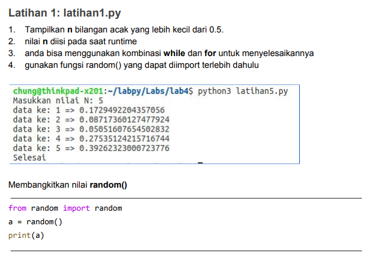
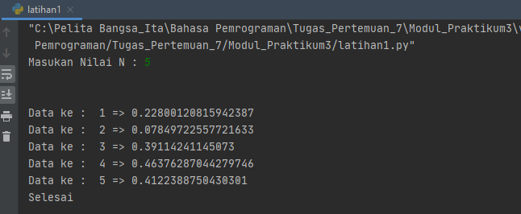
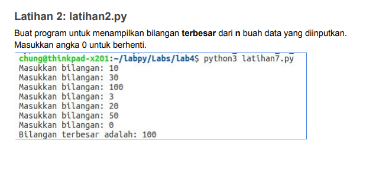
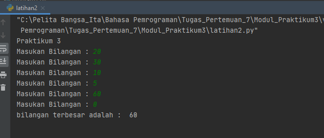
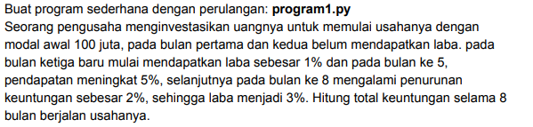
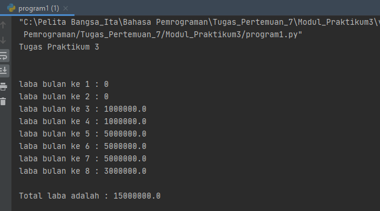

# labpy03
Repository ini dibuat untuk memenuhi tugas bahasa pemrograman pertemuan ke-7 pada Modul Praktikum 3.

***Nama : Miftahu Rizkiyah***
 
***NIM : 312010014***

***Kelas : TI.20.B.1***

* Pada repository ini saya mendapatkan tugas dari Dosen Bahasa Pemrograman, untuk program yang ada pada latihan 1, latihan 2 dan program 1.
untuk tugas-tugas tersebut bisa dilihat pada link berikut : <br>
1. [link_latihan1](latihan1.py)
2. [link_latihan2](latihan2.py)
3. [link_program1](program1.py)
<br>


Pertama saya akan membahas tentang tugas latihan 1 yaitu menampilakn (n) bilangan acak yang lebih kecil dari 0.5.
diprogram ini saya menggunakan source code seperti dibawah ini : <br>

``` python
n=int(input('Masukan Nilai N : '))

import random

for a in  list(range(1, n+1, 1)) :
    print("Data ke : ",a, "=>",random.uniform(0, 0.5))

print("Selesai")
```
Pada source code tersebut saya menggunakan kombinasi random dan uniform, sehingga menghasilkan output seperti dibawah ini : <br>


* Note : <br>
fungsi random() akan menghasilkan angka yang memiliki tipe data float dan berada pada rentang 0,0 hingga 1,0. Pada fungsi ini tidak perlu menambahkan argument. <br>
uniform sendiri berfungsi untuk menampilkan bilangan float random dengan batas awal bilangan dan batas akhir.


* **Latihan 2**

Pada latihan ke-2 ini Dosen memberikan tugas untuk menampilkan bilangan terbesar dari (n). <br>



Pada tugas ini saya menggunakan source code :
``` python
print("Praktikum 3")

a=0
while True:
    bilangan = int(input("Masukan Bilangan : " ))
    if (a < bilangan):
        a=bilangan
    if (bilangan == 0):
        break

print("bilangan terbesar adalah : ",a)
print()
```
Pada source code ini akan menghasilkan output seperti : 


* Note : <br>
- Perulangan **(while)** disebut uncounted loop (perulangan yang tak terhitung), yaitu perulangan yang dilakukan berdasarkan kondisi tertentu selama nilai kondisi bernilai **True**
- Kondisi **if** digunakan untuk mengeksekusi kode jika kondisi bernilai benar (True)
- Pernyataan **Break** digunakan untuk menghentikan process perulangan pada kondisi tertentu.

<br>

* **Program 1**

Pada program 1 ini akan menghitung laba seorang pengusaha dalam waktu 8 bulan terhitung dari bulan pertama.

 
 Dalam program ini saya menggunakan source code seperti dibawah ini.
``` python
print("Tugas Praktikum 3")
print("\n")

modalawal = 100000000

for bulan in range(1, 9, 1):
    # Menentukan laba pada bulan pertama dan kedua
    if (bulan>=1) and (bulan<=2):
        #laba bulan 1 dan 2 adalah 0%
        laba12 = modalawal * 0
        print(f"laba bulan ke {bulan} : {laba12} ")
    if (bulan>=3) and (bulan<=4):
        #laba bulan 3 dan 4 adalah 1%
        laba34 = modalawal * 0.01
        print(f"laba bulan ke {bulan} : {laba34} ")
    if (bulan >= 5) and (bulan <=7):
        #laba bulan 5, 6, 7 adalah 5%
        laba567 = modalawal * 0.05
        print(f"laba bulan ke {bulan} : {laba567} ")
    if bulan == 8:
        laba8 = modalawal * 0.03
        print(f"laba bulan ke {bulan} : {laba8}" )

totallaba = laba12 + laba12 + laba34 + laba34 + laba567 + laba567 +laba8

print(f"\nTotal laba adalah : {totallaba} ")
print
```
dari source code tersebut kita akan mendapatkan ooutput : <br>


* Note : <br>
- Kondisi **if** digunakan untuk mengeksekusi kode jika kondisi bernilai benar (True)
Pada setiap bulan nya pengusaha mengalami penurunan dan kenaikan keuntungan / laba,

<br>

+=+=+=+=+=+ ***Thank You***  +=+=+=+=+=+=+=
========== ***Miftahu Rizkiyah*** ==========
++++++++++++++ ***312010014*** ++++++++++++


